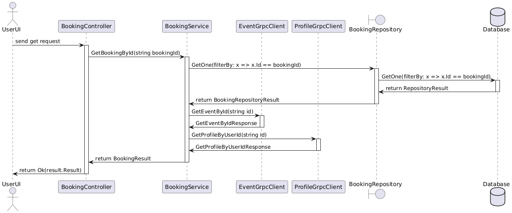
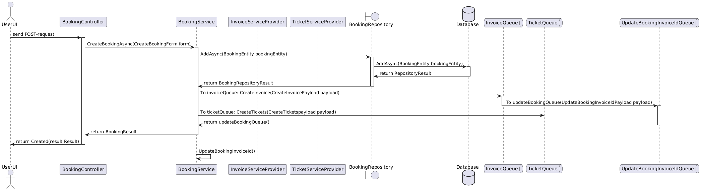

# BookingServiceProvider
This is a microservice built with ASP.NET Core 9.
It uses SQL Server, Entity Framework Core, gRPC, REST APIs, and Azure Service Bus Queues.

This project was developed as part of the ASP.NET 2 course at Nackademin.
The goal was to work collaboratively to build multiple microservices that communicate through REST and/or gRPC, and deploy them using various Azure services (web apps, databases, service buses, etc.).

## Functions
### ASP .NET Core Web Api (Base route: "api/bookings")
GET
  - GetAllBookings: Fetches all bookings in the entire database.
  - GetBookingsByStatus(int statusId): Recieves an int representing the statusId from the params. Statuses such as "Pending", "Confirmed", "Cancelled" with an int as key. Fetches all bookings with a specific statusId. Route "string/{statusId}"
  - GetBookingsByEvent(string eventId): Recieves a string in form of a guid from the params, representing the eventId. Fetches all bookings connected to a specific event. Route "event/{eventId}" 
  - GetBookingsByUser(string userId): Recieves a string from the params in form of a guid that is the userId. Fetches all bookings made by a specific user (should be logged in in the future). Route "user/{userId}"
  - GetBookingById(string id): Recieves a string from the params in form of a guid.
 POST
  - AddNewBooking(CreateBookingForm form): Requires a form with EventId, UserId, TicketCategoryName, TicketQuantity and TicketPrice. Adds a new booking to the database and publish to an Azure Service Bus in two different queues. Queues "create-invoice" and "create-tickets" have other microservices as listeners. One creates tickets based on the provided information (price, quantity etc) and one creates an invoice. When an invoice is created, that InvoiceServiceProvider publishes to another queue that my microservice listens to as a background service. When the invoice is created seperatley, my listener triggers a method that updates the booking with the given invoiceId.
PUT
  - UpdateBooking(UpdateBookingForm form): Requires the Id of the booking, EventId, UserId, StatusId TicketCategoryName, TicketQuantity and TicketPrice. Should not be used unless by an admin.
DELETE
  - CancelBooking(string id): Recieves a string id and changes the statusId so the status is "cancelled". Unused, only there since early development discussions. Route "{id}".
  - DeleteBooking(string id): Recieves a string id and deletes the booking from the database. Route "delete/{id}".

### gRPC
All of CRUD. Should be used by other microservices to get booking data by the Id faster than with REST. Because of gPRC I did not use Azure Functions as my presentation webapp. I had to use Web Api because AF doesn't support gPRC when publishing live. 

### ASB Azure Service Bus Queues
I only used Queues and not Topics due to the cost at Azure. I have two different service bus handlers that publishes to two seperate queues that other systems are listening to. I have one service bus listener running as a background service, which is much easier to configure with Azure Functions. I use Asp .Net Core Web Api because of gPRC. I also created TicketServiceProvider that uses AF for my controllers and service bus listeners instead of a Web Api. 

### Improvements
Due to insufficient time I don't handle any tokens to check if the user that made the rest-request is of a certain userRole or if the user is the owner of the booking. I would like to implement authorization to the endpoints in the future. If I were to remake this project I would try to do better planning. Now that I have a better understanding of the structure and more knowledge of how the communication chain looks like. I tried making some sequence diagrams.

